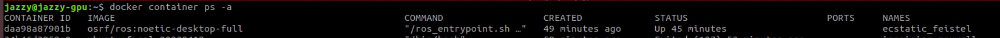
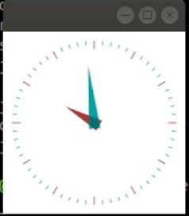
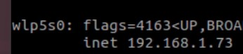
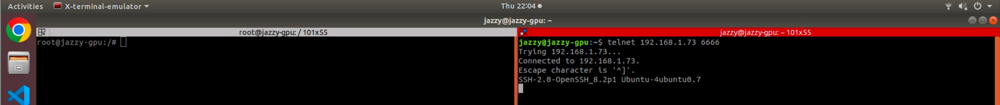

# Docker Practice of AIRO Lab
<p align="justify">With the increasing number of lab members, we are now enforcing a new practice of Docker on publich computing devives, i.e., for all members that wish to use lab machines (including GPU server, UAV/UGV onboard computers, or even UUV in the future), will be required to use Docker container to run their code. The following are the reasons:</p>

- repeating setups for environs are no more needed.
- clashes between libraries could be prevented.
- it's cool.

<p align="justify">
It might be painful at first, but for the <b>COLLECTIVE GOOD AND NEAT PRACTICE</b>, we hope that everyone could cooperate. We have setup a docker container (not constructed with a systematical way yet it work), you can just simply do <b>docker pull {image}</b> and start to do a lotta shit (run ROS and stuff basically). 

Below will first briefly elucidate what we have done to this poor image, and how to <b>ssh, network sharing and visualize files</b>; some ros packages are also included so feel free to try. This repo is in the public domain, people outside our lab are welcomed to use. Similar to many other repo of ours, we love pull requests, so please do offer suggestions!
</p>

## Prerequisite
Refer to this [site](https://docs.docker.com/engine/install/ubuntu/), you can install Docker Engine by following the setup bash command. In Ubuntu, we do not really need Docker Desktop. As we are not considerate people, we will not repeat the installation process here.

First do 

```
docker pull pattylo/airo_ros_noetic:lala
```

to download the **airo_ros_noetic** image.

Skip the setup description and go [here](#what-you-should-test) if you are in rush.

## What we have done (PART I - Setup).
### You don't need to do anything here yet!
   
1. **Layered upon other image**
   
   We docker pull a ros-noetic-image
    ```
    docker pull osrf/ros:noetic-desktop-full
    ```
2. **Setup network and hardware connection**
   
   To allow all hardware and software communication between the host and the container, we run a shell script to fire up the image. The container is launch through this [file](/lala_noetic.sh).
   
3. **Install shit that we need**
   
   We then install some usefull packages 
   ```
   sudo apt updage
   sudo apt gra
   sudo apt install tmux
   sudo apt install x11-apps #this one pretty useless though
   sudo apt install cmake-gui
   sudo apt install wget
   sudo apt install curl
   .
   .
   .
   # and a few I am too lazy to type it out, 
   # go to the .bash_history file in the container to check it your self.
   ```
4. **Install more shit**
   
   We then try to install some ros packages: [RealSense_ROS_wrapper](https://github.com/IntelRealSense/realsense-ros/tree/ros1-legacy),[E2ES](https://github.com/HKPolyU-UAV/E2ES), and [yolo_ros_plugin](https://github.com/HKPolyU-UAV/yolo_ros_plugin). All packages ran smoothly, and communication (visualization showcase and data transmission) between host and container was all good.

5. **In short**
   
   Just to be clear, below lists main packages that we have installed:
   ```
   ros-noetic-full-desktop
   OpenCV 4.5.5
   mavros
   mavros
   librealsense
   realsense-ros-wrapper
   PX4-AutoPilot @ Gazebo
   ```
   For GPU-utilization, we will create another independent container for that @ [TBC](/hahhaha).
   


## What have we done (PART II - Connection Setup).
### You don't need to do anything here yet!
We reckon that people will need to perform files modification on-site, and hence we have setup a ssh practice so that you could visualize your code. Below are the things that were done:

1. **Install SSH**
   ```
   sudo apt update
   sudo apt install openssh-server
   sudo apt install net-tools
   ```
2. **Change root passcode**
   ```
   passwd root
   # 0000
   ```
3. **Modify sshd_config to allow remote access**
   ```
   gedit /etc/ssh/sshd_config
   # add "PermitRootLogin Yes" into the file
   ```
4. **Modify more related to ssh**
   
   As our container is bundled with the host network, the default ssh port should be change, so that the container could be ssh-able.
   ```
    sed -i 's/\(^Port\)/#\1/' /etc/ssh/sshd_config && echo Port 6666 >> /etc/ssh/sshd_config
   ```
   So now the port number for SSH is 6666.
5. **SSH automation**
   
   Start SSH automatically. SSH can be start manually via
   ```
   service ssh start
   ````
   Yet it is stupid not to mention inconvenient to do this repeatedly when you start your container, so we did:
   ```
   gedit /ros_entrypoint.sh
   # add "service ssh restart"
   ```
6. **In short**
   
   We did a few thing to enable SSH server. 

## What you should test.
### You need to do something now!
So far, we have be blabbering for quite awhile. It's high time for you to do something to check!
1. **Check container status**
   
   After you pull our image 
   
   (it's ```docker pull pattylo/airo_ros_noetic:lala``` if you have not do so), 
   
   do
   ```
   source lala.sh 
   ```
   [lala.sh](./lala.sh) is a shell script file from this repo. A container should be generated. 
   
   Check whether the container is up by
   ```
   docker container ps -a
   ```
   There should be a container listed as:

   

2. **Check visualization** 
   
   Run ```xclock``` and see whether there is a tiny little clock appears like this:
    
    .

   The time might not be right, but it is not really important at this stage.
3. **Check hardware connection** 
   
   In the docker run file, we have specified ```-v/dev:/dev```, which gives basically all USB access to container. 
   
    The easiest way to confirm the connection is to run ```roslaunch realsense2_camera rs_camera.launch```, and outside container simply do ```rqt_image_view``` to check the message.

    You can also try to do ```ls /dev/tty``` to check whether the ttl serial is connected.
   
 
4.  **Check external connection** 
   
    First download telnet, it allows you to check the connection with a specified port. 

    Do the following to check ```IP_ADDRESS```.
    ```
    ifconfig
    ```
    

    Then, **outside** your container, do
    ```
    sudo apt install telnet
    telnet {IP_ADDRESS} 6666
    ```
    You should get something like below which shows:
    ```
    Trying {IP_ADDRESS}
    Connected to {IP_ADDRESS}
    ```

    
    Within the image, LHS shows container, whilst RHS shows telnet connection status.

5. So far so good? Now, on any laptop within the same local network, try to do:
    ```
    ssh root@{IP_ADDRESS} -p 6666
    # passcode 0000
    ```

    You should be able to access the container by now. Now, you own a tiny OS within your OS, isn't it interesting?

6. On vscode, access the files inside the container just as an usual ssh server.

## Side Note
1. Basically, you should be able to use it as a normal ubuntu ROS environment, just within a sandbox. Again, the main reason for us to use this is that it allows us to setup enviroment on a new machine with only one commandline: i.e., ```docker image pull pattylo/airo_ros_noetic:lala```.
2. Basically image is like a template of a container. Bear this in mind.
3. Some useful docker commandline for your reference:
    ```
    docker image pull {image_name} # pull an image
    docker run -blah_blah {image_name} # run an image and create a container
    docker container ps -a # list all container
    docker image ls # list all image
    
    docker start {container_name} # start container
    docker attach {container_name} # attach to a container, namely, get inside the container
    exit # exit container

    docker commit {container_name} {new_image_name} 
    # create an image after you modify a container
    # this could become your new template

    docker rm {container_name}
    docker rmi {image_name}

    docker tag {container_name} {username}/{remote_image_name}
    docker push {username}/{remote_image_name}
    # basically allow you to publish your image
    ```
4. The learning curve of Docker is not steep. We are not very experienced, but were able to pick it up within a week. Just try to search more learning material lah! Have fun Dockering!

## Shoutout
We would like to give a shoutout to the [Larics Lab](https://github.com/larics) for inspiring us to adopt this practice. Go follow them! They are doing some solid engineering work there!

## Maintainer
[pattylo](https://github.com/pattylo) @ AIRO-LAB @ RCUAS, HKPolyU
