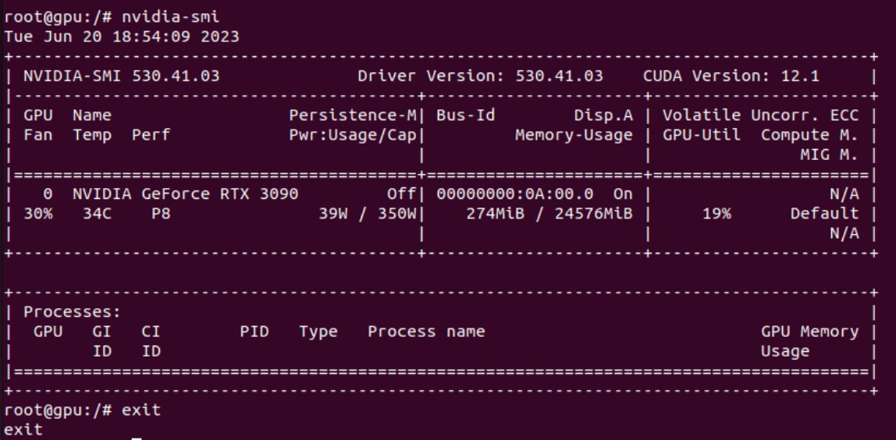
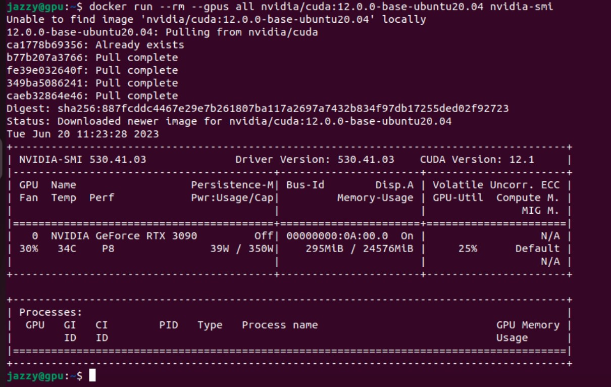
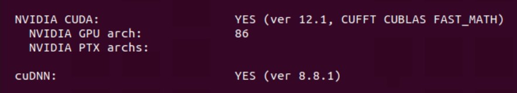

# Docker Practice of AIRO Lab - GPU
The GPU-equipped machine sitting at GH034 prohibits **ANYONE** to install anything. It is for the better good, trust us. 

```
./lalagpu.sh # on GH034 GPU
```

Voila! You may now configure [ngrok](https://github.com/HKPolyU-UAV/useful_tools/blob/main/remote/Remote.md), and access the machine anywhere and have fun with GPU.


## Just For Your Reference
The following is just a brief description of what I have done to this our machine and this poor image. Note that our environment is Ubuntu 22.04 (x86_64) w/ RTX3090 GPU.

1. **Prerequisite (Host)**
   
   Confirm Nvidia driver.

   ```
   nvidia-smi
   ```
   and make sure the following was retreived:

   

   Then,

   ```
   git clone https://github.com/NVIDIA/cuda-samples.git
   cd cuda-samples/Samples/1_Utilities/deviceQuery
   make
   ./deviceQuery
   ```
   and make sure the following was retreived:

   


2. **Install Nvidia-Docker-related Shit (Host)**
   
   Make sure docker is installed
   ```
   docker --version
   ```

   Then, 
   ```
   curl -fsSL https://nvidia.github.io/libnvidia-container/gpgkey | sudo gpg --dearmor -o /usr/share/keyrings/nvidia-container-toolkit-keyring.gpg
   sudo nano /etc/apt/sources.list.d/nvidia-container-toolkit.list
    # paste deb [signed-by=/usr/share/keyrings/nvidia-container-toolkit-keyring.gpg] https://nvidia.github.io/libnvidia-container/stable/ubuntu22.04/$(ARCH) /
   sudo apt update
   sudo apt install nvidia-docker2
   sudo reboot
   ```

3. **Confirm GPU Accessibility**
   
   ```
   docker run --rm --gpus all nvidia/cuda:12.0.0-base-ubuntu20.04 nvidia-smi
   ```

   And got something like this:

   

   Run a test docker image.

   ```
   docker run -it --gpus all nvidia/cuda:12.1.0-devel-ubuntu20.04 
   ```
   
   Actually, we ran [lala_nvidia.sh](/lala_nvidia.sh) so that we could share the internet and hardware access of the host. Note that the only difference with [lala.sh](/lala.sh) is that there is a ```--gpus all``` argument.


4. **Setup Container and Test Environment (Container)**
   
   Inside the run-image, we did the followings:
   
   ```
   apt install update
   apt install upgrade
   cd /home
   git clone https://github.com/NVIDIA/cuda-samples.git
   cd cuda-samples/Samples/1_Utilities/deviceQuery
   make
   ./deviceQuery
   ```
   
   And got the same result as in host.

5. **Install Some Irrelevant Shit (Container)**
   
   ```
   # sudo apt install nano gedit curl tmux ros
   ```

6. **Install cudnn (Container)**
   
   Went here to download zip file: https://developer.nvidia.com/rdp/cudnn-download. We here downloaded *cuDNN v8.8.1 (March 8th, 2023), for CUDA 12.x*  Then,

   ```
   docker cp cudnn-linux-x86_64-8.8.1.3_cuda12-archive {container_ID}:/home/Downloads/cudnn-linux-x86_64-8.8.1.3_cuda12-archive
   ```

   Then move them around

   ```
   sudo cp {whatever_it_is_called}/include/cudnn*.h /usr/local/cuda/include
   sudo cp -P {whatever_it_is_called}/lib64/libcudnn* /usr/local/cuda/lib64
   sudo chmod a+r /usr/local/cuda/include/cudnn*.h /usr/local/cuda/lib64/libcudnn*

   sudo cp -P {whatever_it_is_called}/include/cudnn.h /usr/include
   sudo cp -P {whatever_it_is_called}/lib64/libcudnn* /usr/lib/x86_64-linux-gnu/
   sudo chmod a+r /usr/lib/x86_64-linux-gnu/libcudnn*

   ```
   Check cuDNN path
   ```
   whereis cudnn
   ```

7. **Install OpenCV**
   
   Install some dependencies and libraries first.
   
   ```
   sudo apt-get update
   sudo apt-get upgrade

   sudo apt install cmake pkg-config unzip yasm git checkinstall libjpeg-dev libpng-dev libtiff-dev libavcodec-dev libavformat-dev libswscale-dev libavresample-dev libgstreamer1.0-dev libgstreamer-plugins-base1.0-dev libxvidcore-dev x264 libx264-dev libfaac-dev libmp3lame-dev libtheora-dev libfaac-dev libmp3lame-dev libvorbis-dev libopencore-amrnb-dev libopencore-amrwb-dev

   sudo apt-get install libdc1394-22 libdc1394-22-dev libxine2-dev libv4l-dev v4l-utils

   cd /usr/include/linux
   sudo ln -s -f ../libv4l1-videodev.h videodev.h
   
   sudo apt-get install libgtk-3-dev libtbb-dev libatlas-base-dev gfortran

   ```

   For ```CUDA 12.1``` and ```cudnn 8.1.1``` (again, on RTX3090), we installed OpenCV 4.7.0, since some folks (兄弟) online say that this serves a more stable compilation (and empirically speaking, **IT IS**... we have tried A LOT of versions and finally get it down).

   ```
   wget -O opencv.zip https://github.com/opencv/opencv/archive/refs/tags/4.7.0.zip
   wget -O opencv_contrib.zip https://github.com/opencv/opencv_contrib/archive/refs/tags/4.7.0.zip
   unzip opencv.zip
   unzip opencv_contrib.zip
   ```

   Below is the standard process of compiling OpenCV from source with cmake-gui. And of course, you can use cmake-gui if you like.

   ```
   # in opencv-x.x.x
   mkdir build
   cd build
   ```
   and do

   ```
   print(cv2.getBuildInformation())
    cmake -D CMAKE_BUILD_TYPE=RELEASE \
    -D CMAKE_INSTALL_PREFIX=/usr/local \
    -D WITH_TBB=ON \
    -D ENABLE_FAST_MATH=1 \
    -D CUDA_FAST_MATH=1 \
    -D WITH_CUBLAS=1 \
    -D WITH_CUDA=ON \
    -D BUILD_opencv_cudacodec=OFF \
    -D WITH_CUDNN=ON \
    -D OPENCV_DNN_CUDA=ON \
    -D CUDA_ARCH_BIN=8.6 \ # should be your own compute capability
    -D WITH_V4L=ON \
    -D WITH_QT=OFF \
    -D WITH_OPENGL=ON \
    -D WITH_GSTREAMER=ON \
    -D OPENCV_GENERATE_PKGCONFIG=ON \
    -D OPENCV_PC_FILE_NAME=opencv.pc \
    -D OPENCV_ENABLE_NONFREE=ON \
    -D OPENCV_PYTHON3_INSTALL_PATH=$(python3 -c "from distutils.sysconfig import get_python_lib; print(get_python_lib())") \
    -D PYTHON3_PACKAGES_PATH=$(python3 -c "from distutils.sysconfig import get_python_lib; print(get_python_lib())") \
    -D PYTHON_EXECUTABLE=$(which python3) \
    -D OPENCV_EXTRA_MODULES_PATH=/home/Downloads/opencv_contrib-4.7.0/modules \ # please set the right path to contrib modules
    -D INSTALL_PYTHON_EXAMPLES=OFF \
    -D INSTALL_C_EXAMPLES=OFF \
    -D BUILD_EXAMPLES=OFF ..
   ```

   and do
   
   ```
   nproc
   make -j{no_of_cores}
   ```

   Wait...and when finish do
   ```
    sudo make install
    sudo /bin/bash -c 'echo "/usr/local/lib" >> /etc/ld.so.conf.d/opencv.conf'
    sudo ldconfig
   ```

   Then we confirm the installation
   ```
   python3 -c "import cv2; print(cv2.getBuildInformation())"
   ```
   Below shows the results, in which CUDA and cuDNN should show "YES":
   

## Sidenote
Please note that the above settings are for **OUR MACHINE**, and the configurations differ from computer to computer. Also, if you wanna follow the above procedures to setup your own docker, please do understand what exactly does each commandline do. Please do not blame us if you screw up your own environment. **YOUR MACHINE, YOUR RESPONSIBILITY**. 

Although we seem mean, but feel free to drop a discussion message with us.

## Reference
- https://linuxhint.com/install-nvidia-drivers-on-ubuntu/
- https://linuxhint.com/use-nvidia-gpu-docker-containers-ubuntu-22-04-lts/ 
- https://medium.com/@pydoni/how-to-install-cuda-11-4-cudnn-8-2-opencv-4-5-on-ubuntu-20-04-65c4aa415a7b

## Maintainer
[pattylo](https://github.com/pattylo) @ AIRO-LAB @ RCUAS, HKPolyU

